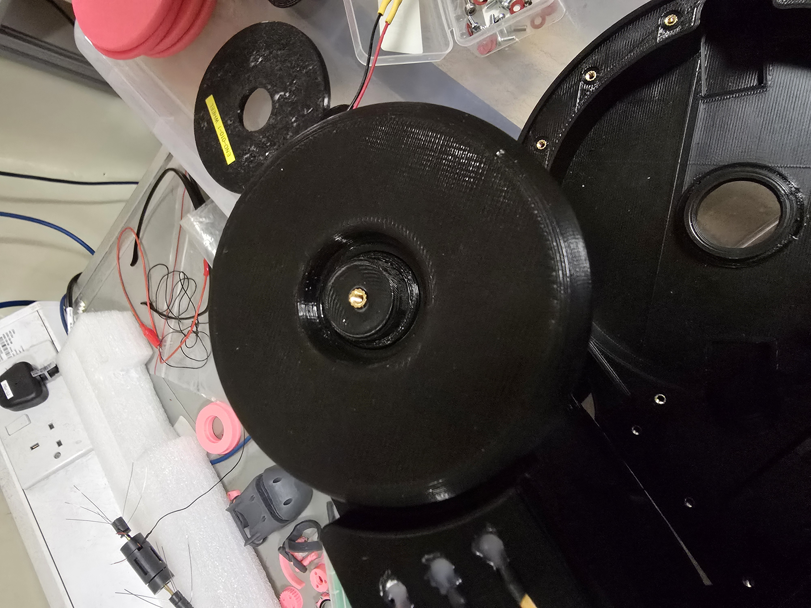

# Project 164 Endoscope Documentation

This repository contains the documentation for the MECH5080M: Project 164 Endoscope Project.

## Index

- [Endoscope Hardware Assembly](#endoscope-hardware-assembly)
- [Endoscope Software](#endoscope-software)

## Endoscope Hardware Assembly

This document describes the assembly of the endoscope.

### Parts

See the [EndoscopeInventory.xlsx](EndoscopeInventory.xlsx) file for a list of parts.

### Chassis Assembly

Note: all screws need the appropriate threaded inserts to be heat-set into the 3D printed parts.

#### Chassis Base

The chassis base houses the Dynamixel, Endoscope Camera Board, RealSense 435i, and Extrusion System. The Dynamixel is fixed using M2.5 screws (see 1 in the image below).

The Endoscope Camera Board is fixed using M2 screws (see 2).

The mounting of the Worm Gear to the Dynamixel is unchanged from the previous design. It may be necessary to add lubrication to the Worm Gear.

The RealSense 435i is mounted at the front of the chassis base with M3 screws through the vertical divider between the Endoscope Camera Board and the RealSense 435i (see 3).

The Endoscope Camera connects to the Endoscope Camera Board and is passed through the base of the chassis to enter the extrusion system from below (see 4) - this is the same as in the previous design as well.

#### Chassis Middle

The chassis middle is mounted on top of the chassis base and attached with screws going through the bottom of the chassis middle into the chassis base. These are numerous but are, for the most part, unfortunately obtuse to access. The screws are M2.5x10mm. Ensure at least two diagonally opposite screws are in place.

The chassis middle houses the Raspberry Pi 5 with NVMe hat, the TEP-100UIR, a boost converter, a Pi PICO for External LED control, the U2D2, the 5V Buck Converter for the Pi 5 power supply, two Wide Angle Pi Camera modules.

The Raspberry Pi 5 is mounted using M2.5 screws - reuse the ones from the original. See 1 in the image below.

The TEP-100UIR is mounted using M3 screws. See 2.

The boost converter and Pi PICO are glued onto the chassis. See 3 for a more detailed view.

The U2D2 and 5V Buck Converter are also glued onto the chassis. See 4.

The Camera modules are mounted with M2 screws. One in the front mounting area which doubles as space for a RealSense D405 and one on a shelf for an upwards viewing angle. See 5.

A 12V bus is hot glued to the chassis middle wall in 6, this distributes 12V from the TEP-100UIR to the Buck Converter, Boost Converter, U2D2, and, optionally, the LED switch board.

The LED bus is shown in 7. The input voltage is selected by a JST 2-pin connector which can either be connected to the 12V bus (see 6) or the 20V output from the boost converter (the wire is labelled `LED INPUT`).

Push Bowden Tubing into the pneumatic fitting.

An additional part of the chassis middle has a bearing mount that is printed separately and glued into place. This goes above the helical gear and provides a surface for the top bearing to sit on.

The majority of the external LEDs are mounted on the chassis middle. This is done in a similar manner to the original design.

##### Pi 5 Pin Layout

The Raspberry Pi 5 Pin Layout can be seen in the image below.

- Pin 1: 3.3V (Power for Pi PICO)
- Pin 3: Bit0 input for External LED Control
- Pin 5: Bit1 input for External LED Control
- Pin 7: Unused
- Pin 9: Ground (for Pi PICO)
- Pin 4: 5V (Power for Pi 5)
- Pin 6: Ground (for Pi 5)

#### Chassis Lid

The chassis lid is in two parts. The larger section is secured first over the internals. Attach the LEDs to the LED board and place the lid on the top of the chassis middle. Secure the lid with M2.5 screws.

Install a guidance block and attach the smaller lid section. This is partially secured by being pushed beneath the larger lid section.

### Wire/Camera Installation Steps

#### Step 1 - Nitinol Wire Installation

Push the Nitinol wire through the entry point in the insert and fix with M2.5 grub screws once the wire is in the correct position. Ensure that the fixing is secure.

The easiest way to do this is to push the nitinol wire through the hole on the outer cylindrical face of the insert.

Fish the wire out of the insert hollow and pull through until the nitinol wire is at least flush with the outside face.

Tighten the grub screws on the top and bottom of the insert. Take care not to overtighten. Test that the wire is secure by pulling on it gently.

#### Step 2 - Camera Installation

Push the wire through the hole labelled 1 in the image above. The bearing can be removed to make this easier. Alternatively, this can be done after spooling the camera and the nitinol, though the bearing will need to be removed. Then push the wire through hole number 2 from the inside of the insert (central cylinder) into the insert hollow and the out to the top of the insert.

Next is attaching the camera wire to the nitinol. It should be glued at the end and then affixed with adhesive heat shrink along its length. From testing, this should be at least every 5cm.

Once the required length of camera wire is attached to the nitinol wire, the nitinol with no wire can be spooled into the insert hollow. Ideally, the wire should be attached to the nitinol wire at the point where the camera wire enters the insert hollow. This prevents loose wire inside the hollow (which can cause tangling, especially when re-spooling). After this, the rest of the nitinol/camera wire can be spooled into the insert hollow.

Push the insert into the outer helical gear ensuring the correct alignment of the camera wire.

As seen in the image above and also in location 3 of the first image of this section, push the camera wire through the hole in the chassis base. Route appropriately to the camera board.

Place the helical gear/insert assembly into the chassis base. Push the nitinol through the bowden and place the chassis middle on top of the chassis base.

The helical gear uses two 30mm ID 42mm OD bearings. Secure the middle chassis to the base chassis and complete the assembly.

### Wheel Assembly

The wheels are mounted on the middle chassis. A wheel spacer is placed onto the wheel hubs and a 20mm ID 32mm OD bearing is placed on top of the wheel spacer. The wheel is then placed on top of the bearing. Finally, a hub cap is placed on top of the wheel hub and the entire thing secured in place with an M3 screw.

## Endoscope Software

In `/home/pharos/students/endo_ws/` is a ROS2 workspace a package:

- `external_led_control`: A package containing a node controlling GPIO pins to change the mode of external Chassis LEDs.

The `external_led_control` package has a node that can be used to control the mode of the external LEDs on the chassis.
The node is called `led_controller` and it listens on the topic `/led_control_mode`. The topic accepts messages of type `std_msgs/msg/String` with the following values:

- `0`: Turn off the LEDs.
- `1`: Turn on the LEDs with 50% duty cycle.
- `2`: Turn on the LEDs with 80% duty cycle.
- `3`: Turn on the LEDs with 100% duty cycle.

For ease of use, in `/home/pharos/scripts` there are several convenience scripts that can be used to control the LEDs:

- `led_controller.sh`: this is used by the `led_controller` node to control the LEDs and should not be removed. It is used to set the GPIO pins and control the external LEDs and can also be used as a standalone script outside of a ROS2 environment.
- `send_led_control_mode.sh`: this script can be used to send messages to the `/led_control_mode` topic to control the LEDs. It accepts a single argument which is the mode to set the LEDs to (0, 1, 2, or 3).
- `leds_on_boot.sh`: this script is used in the `/home/pharos/.profile` file and flashes the external LEDs when the system boots up and logs in.
- `rs_start.sh`: this script launches the RealSense camera node with the correct configuration to have IMU enabled. Sometimes when the node starts, there is ROS `[WARN]` output related to `Hardware Notification: Motion Module Failure`. When this occurs, just stop the node and run the script again.
  - To validate that the IMU is running do `ros2 topic echo /camera/camera/accel/sample` and you should see the IMU data.
  - The same can be done for `ros2 topic echo /camera/camera/gyro/sample`.

Note that the `/home/pharos/students/endo_ws/install/local_setup.bash` is sourced in the `/home/pharos/.bashrc` file to make the workspace available.
