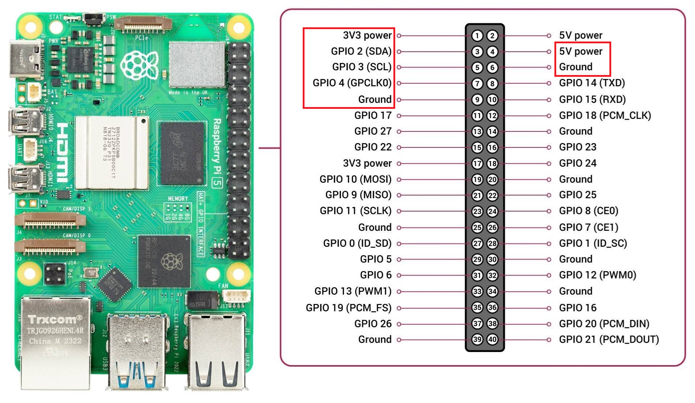
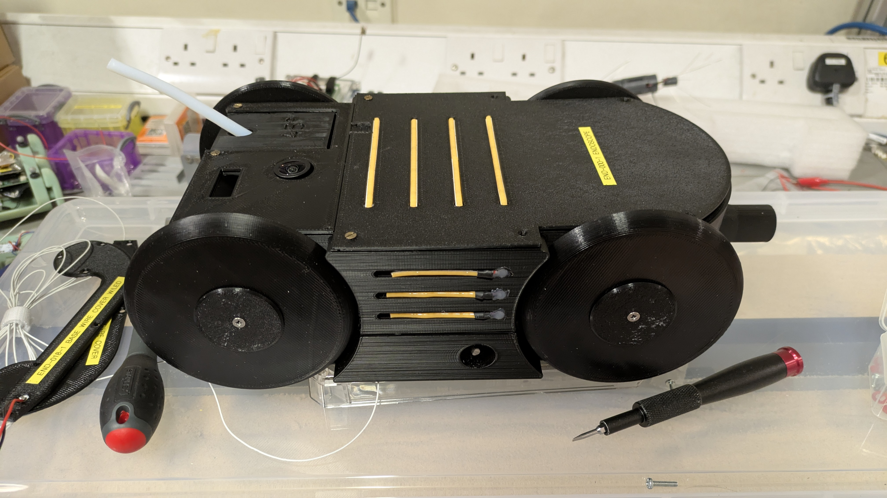
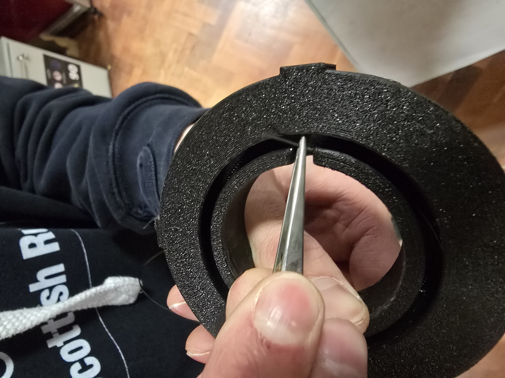
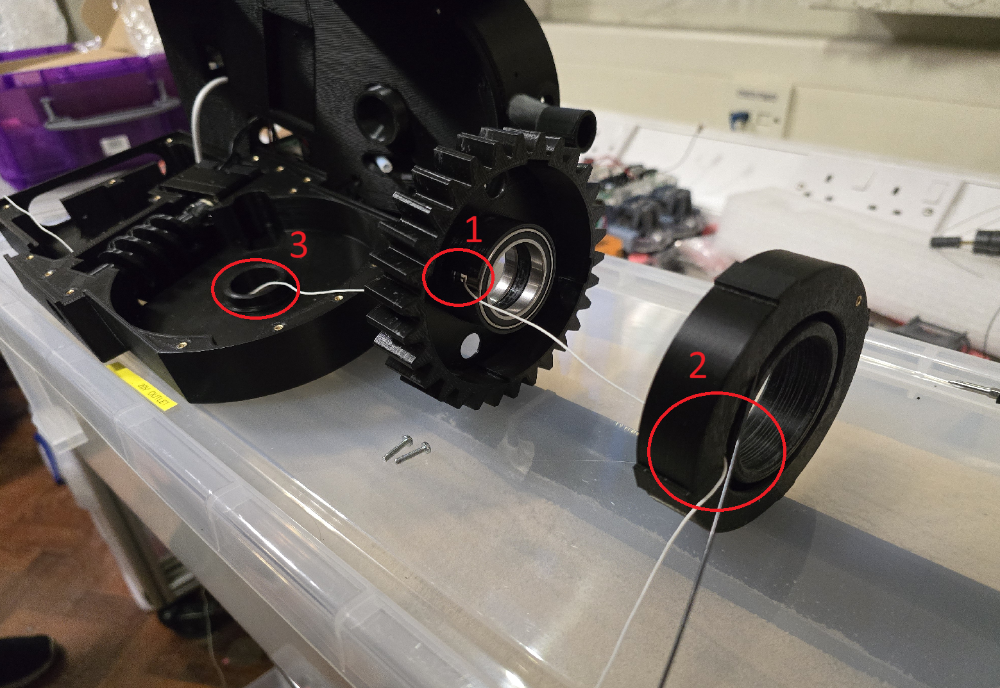

# Endoscope Hardware Assembly

This document describes the assembly of the endoscope.

## Parts
See the [EndoscopeInventory.xlsx](EndoscopeInventory.xlsx) file for a list of parts.

## Chassis Assembly

Note: all screws need the appropriate threaded inserts to be heat-set into the 3D printed parts.

### Chassis Base

The chassis base houses the Dynamixel, Endoscope Camera Board, RealSense 435i, and Extrusion System. The Dynamixel is fixed using M2.5 screws (see 1 in the image below).

The Endoscope Camera Board is fixed using M2 screws (see 2).

The mounting of the Worm Gear to the Dynamixel is unchanged from the previous design. It may be necessary to add lubrication to the Worm Gear.

The RealSense 435i is mounted at the front of the chassis base with M3 screws through the vertical divider between the Endoscope Camera Board and the RealSense 435i (see 3).

The Endoscope Camera connects to the Endoscope Camera Board and is passed through the base of the chassis to enter the extrusion system from below (see 4) - this is the same as in the previous design as well.

### Chassis Middle

The chassis middle is mounted on top of the chassis base and attached with screws going through the bottom of the chassis middle into the chassis base. These are numerous but are, for the most part, unfortunately obtuse to access. The screws are M2.5x10mm. Ensure at least two diagonally opposite screws are in place.

The chassis middle houses the Raspberry Pi 5 with NVMe hat, the TEP-100UIR, a boost converter, a Pi PICO for External LED control, the U2D2, the 5V Buck Converter for the Pi 5 power supply, two Wide Angle Pi Camera modules.

The Raspberry Pi 5 is mounted using M2.5 screws - reuse the ones from the original. See 1 in the image below.

The TEP-100UIR is mounted using M3 screws. See 2.

The boost converter and Pi PICO are glued onto the chassis. See 3 for a more detailed view.

The U2D2 and 5V Buck Converter are also glued onto the chassis. See 4.

The Camera modules are mounted with M2 screws. One in the front mounting area which doubles as space for a RealSense D405 and one on a shelf for an upwards viewing angle. See 5.

A 12V bus is hot glued to the chassis middle wall in 6, this distributes 12V from the TEP-100UIR to the Buck Converter, Boost Converter, U2D2, and, optionally, the LED switch board.

The LED bus is shown in 7. The input voltage is selected by a JST 2-pin connector which can either be connected to the 12V bus (see 6) or the 20V output from the boost converter (the wire is labelled `LED INPUT`).

Push Bowden Tubing into the pneumatic fitting.

#### Pi 5 Pin Layout

The Raspberry Pi 5 Pin Layout can be seen in the image below.

- Pin 1: 3.3V (Power for Pi PICO)
- Pin 3: Bit0 input for External LED Control
- Pin 5: Bit1 input for External LED Control
- Pin 7: Unused
- Pin 9: Ground (for Pi PICO)
- Pin 4: 5V (Power for Pi 5)
- Pin 6: Ground (for Pi 5)

### Chassis Lid

The chassis lid is in two parts. The larger section is secured first over the internals. Attach the LEDs to the LED board and place the lid on the top of the chassis middle. Secure the lid with M2.5 screws.

Install a guidance block and attach the smaller lid section. This is partially secured by being pushed beneath the larger lid section.

## Wire/Camera Installation Steps

### Step 1 - Nitinol Wire Installation

Push the Nitinol wire through the entry point in the insert and fix with M2.5 grub screws once the wire is in the correct position. Ensure that the fixing is secure.

The easiest way to do this is to push the nitinol wire through the hole on the outer cylindrical face of the insert.

Fish the wire out of the insert hollow and pull through until the nitinol wire is at least flush with the outside face.

Tighten the grub screws on the top and bottom of the insert. Take care not to overtighten. Test that the wire is secure by pulling on it gently.

### Step 2 - Camera Installation

Push the wire through the hole labelled 1 in the image above. The bearing can be removed to make this easier. The push the wire through hole number 2 from the inside of the insert (central cylinder) into the insert hollow and the out to the top of the insert.

Next is attaching the camera wire to the nitinol. It should be glued at the end and then affixed with adhesive heat shrink along its length. From testing, this should be at least every 5cm.

Once the required length of camera wire is attached to the nitinol wire, the nitinol with no wire can be spooled into the insert hollow. Ideally, the wire should be attached to the nitinol wire at the point where the camera wire enters the insert hollow. This prevents loose wire inside the hollow (which can cause tangling, especially when re-spooling). After this, the rest of the nitinol/camera wire can be spooled into the insert hollow.

Push the insert into the outer helical gear ensuring the correct alignment of the camera wire.

AS seen in the image above and also in location 3 of the first image of this section, push the camera wire through the hole in the chassis base. Route appropriately to the camera board.

Place the helical gear/insert assembly into the chassis base. Push the nitinol through the bowden and place the chassis middle on top of the chassis base.

Secure the middle chassis to the base chassis and complete the assembly.
