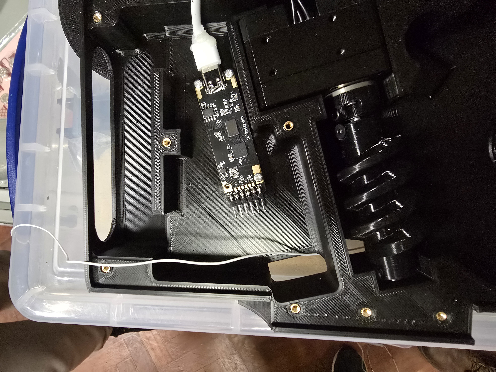

# Endoscope Hardware Assembly

This document describes the assembly of the endoscope.

## Parts
See the [EndoscopeInventory.xlsx](EndoscopeInventory.xlsx) file for a list of parts.

## Chassis Assembly

### Chassis Base

